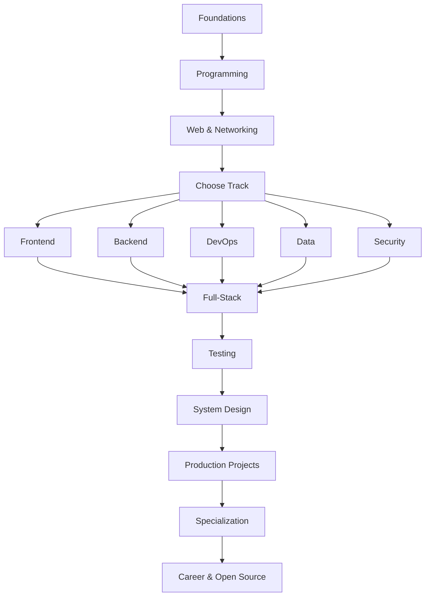

# Ultimate Dev Roadmap

> A production-oriented developer roadmap, resource vault, project ladder, and engineering knowledge base designed for GitHub.

   

## Mission

This repository answers four questions together: **what to learn, where to learn it, what to build, and how to reach production-level engineering ability.**

## Master flow



## Start here

| Area | Guide |
|---|---|
| 🧭 Master index | [roadmap-index](docs/roadmap-index.md) |
| 🎨 Frontend | [frontend-roadmap](docs/frontend-roadmap.md) |
| ⚙️ Backend | [backend-roadmap](docs/backend-roadmap.md) |
| 🏗️ System design | [system-design-roadmap](docs/system-design-roadmap.md) |
| 🔌 APIs | [free-apis](docs/free-apis.md) |
| 🧪 Testing | [testing](docs/roadmaps/testing/01-testing-pyramid.md) |
| 🔐 Security | [security](docs/roadmaps/security/01-owasp-top-10.md) |
| ☁️ DevOps | [DevOps](docs/roadmaps/devops/01-linux-command-line.md) |
| 💼 Career | [Career](docs/roadmaps/career/01-resume-and-portfolio.md) |
| 🧩 Projects | [Projects](docs/roadmaps/projects/fullstack-projects.md) |

## Engineering progression

```text
Understand → Implement → Build → Test → Deploy → Observe → Refactor → Explain
```

## Project ladder

| Level | Outcome | Example |
|---|---|---|
| 01 | Fundamentals | CLI utility |
| 02 | Core skill | CRUD application |
| 03 | API skill | REST service |
| 04 | Data skill | PostgreSQL-backed platform |
| 05 | Full product | SaaS dashboard |
| 06 | Production | Multi-tenant SaaS |
| 07 | Distributed | Event-driven platform |
| 08 | Scale | High-throughput service |

## Repository principles

- Prefer official documentation for foundational facts.
- Explain **why**, not only **how**.
- Separate must-learn topics from optional specialization.
- Connect every major learning stage to practice.
- Treat security, testing, observability, and operations as engineering—not afterthoughts.

## Contributing

See [CONTRIBUTING.md](CONTRIBUTING.md).

## License

MIT. See [LICENSE](LICENSE).
