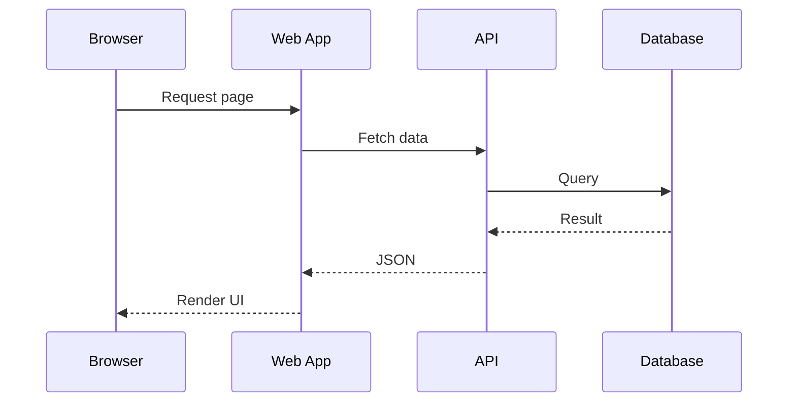

# Full-Stack Request Flow



## Deep Dive

### Mental model

This topic is a system of concepts, constraints, and feedback loops. Learn the model first, then the syntax or commands used to operate it.

### Vocabulary map

- **core concept** — define it in your own words and connect it to one real scenario.
- **boundary** — define it in your own words and connect it to one real scenario.
- **state** — define it in your own words and connect it to one real scenario.
- **input** — define it in your own words and connect it to one real scenario.
- **output** — define it in your own words and connect it to one real scenario.
- **failure mode** — define it in your own words and connect it to one real scenario.
- **trade-off** — define it in your own words and connect it to one real scenario.
- **test** — define it in your own words and connect it to one real scenario.
- **observability** — define it in your own words and connect it to one real scenario.
- **documentation** — define it in your own words and connect it to one real scenario.

### Worked example

```text
Input → validate assumptions → perform operation → verify result → handle failure → document decision
```

### Failure-driven debugging

Good engineers learn the happy path and then deliberately investigate failure. Use this loop:

```text
Observe → Reproduce → Isolate → Hypothesize → Change → Verify → Record
```

Practical debugging moves for this topic:

1. Reproduce the smallest failure.
2. Observe the system before modifying it.
3. Change one assumption at a time.
4. Add a test or diagnostic so the failure is easier to catch next time.

## Production checklist

- [ ] Inputs and assumptions are explicit.
- [ ] Failure behavior is defined.
- [ ] Important invariants are tested.
- [ ] Security boundaries are identified.
- [ ] Observability is sufficient to diagnose normal failures.
- [ ] Documentation explains non-obvious decisions.
- [ ] The implementation is simple enough for another engineer to maintain.

## Teach-back exercise

Explain the topic to someone who knows programming basics but has never used this technology. Use one analogy, one code/example fragment, one failure case, and one reason you would *not* choose the technology.

## Professional deliverable

Create a small artifact that demonstrates this skill and publish a README describing **problem → approach → trade-offs → verification → limitations**.

---

## Diagram Reading Guide

Use this diagram as a reasoning artifact, not decoration. For every arrow, identify what crosses the boundary, what can fail, and what evidence would prove the interaction works.

### Exercise

Redraw the diagram from memory, annotate one latency boundary, one security boundary, one data boundary, and one recovery path.

