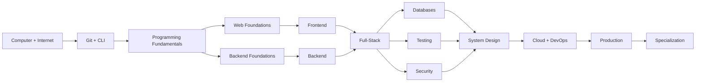

# Roadmap Index

## Master learning graph

## Track directories

- [Frontend](roadmaps/frontend/)
- [Backend](roadmaps/backend/)
- [DevOps](roadmaps/devops/)
- [Databases](roadmaps/databases/)
- [Testing](roadmaps/testing/)
- [Security](roadmaps/security/)
- [System Design](roadmaps/system-design/)
- [Programming Languages](roadmaps/programming-languages/)
- [APIs](roadmaps/apis/)
- [Tools](roadmaps/tools/)
- [Career](roadmaps/career/)
- [Projects](roadmaps/projects/)
- [Learning Paths](roadmaps/learning-paths/)

## Gate rule

Do not move forward because you finished a course. Move forward when you can build, debug, explain, test, and independently consult documentation.
